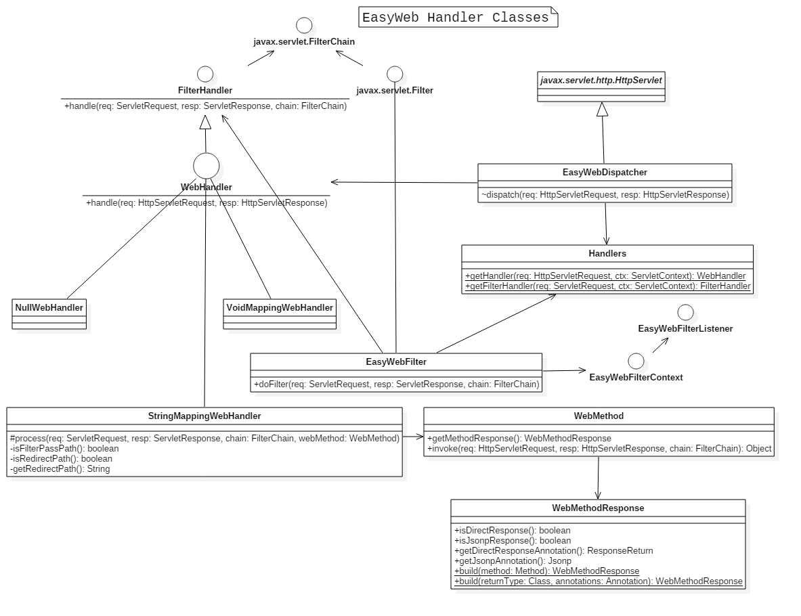

# Class Diagram

The chapter and sections can be helpful for us to understand EasyWeb framework.
Form the class diagrams, we can see two parts of framework:
1. core basic objects and building
  * **WebContextLoadListener** Servlet context listener, initialize framework from here
  * **WebConfigure** Configuration of framework
  * **WebProcesser** Processor of objects such as WebContainer, WebController, WebFilter, WebMethod
  * **WebContainer** store mappings which from request path to WebMethod instance
2. handler for HTTP request
  * **FilterHandler** Base handler, mostly used in EasyWebFilter, hold WebMethod from WebFilter
  * **WebHandler** Handler used in EasyWebDispatcher, hold WebMethod from WebController
  * **EasyWebDispatcher** Main servlet for framework to dispatch http request
  * **EasyWebFilter** Main filter for framework to main servlet EasyWebDispatcher

